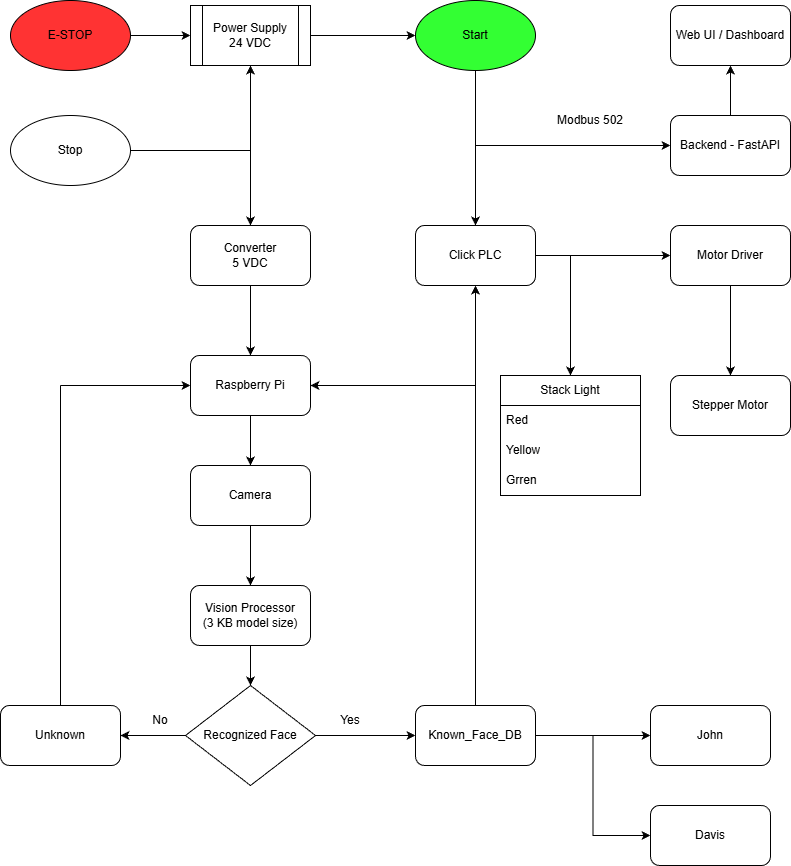

<!-- /*!
\mainpage Smart Access Control (SAC) with PLC -->

# Smart Acess Control (SAC) with PLC

Author: **Davis Onyeoguzoro** 

Date: September 26, 2025

---

## Overview
The **Smart Access Control with PLC** system integrates **machine vision** for face recognition with a **CLICK PLC** for deterministic, safe control of actuators like **Stack lights, buzzers, and stepper motors**.

It combines the flexibility of **Raspberry Pi 5** (Vision and AI) with the reliability of **Industrial PLC hardware** which makes it suitable for academic research as well as factory scenarios.

## Key Features
- Real-time face recognition and allow/deny policy
- Stack lights: Green = Access Granted, Red = Denied, Yellow = Processing
- Motor control via stepper or relay output
- PLC safety interlocks: E-Stop (NC), watchdog heartbeat, manual overides
- Event logging and remote monitoring via MQTT and REST API

## Process Flow Diagram

## System Architecture
Safety
- All outputs are conditioned on SafetyOK
- E-Stop NC breaks power path and drops "SafeyOK" motion OFF, and stacklight RED

Network and Security
- Modbus TCP 502 is on an isolated VLAN
- MQTT broker 1883 with TLS for events

Actuation
- Ladder Logic: Rungs gate every output through "SafetyOK"
- E-Stop NC: Hardwired to cut motion of actuators and devices, logic forces RED

Machine Vision
- Camera + Vision to detect and recognize faces
- Controller state machine for states (Idle, Detect, Decide, Allow/Deny, Reset)

## Functional Requirements
- Face Detection: The camera captures the faces and the machine model on the Raspberry Pi detect faces in incoming frame

- Recognition: The Raspberry PI compares the captured face against a face-encoding database and produces both the name and the confidence of the prediction

- Decision: For each frame cycle, the controller wwould output a single decision - ALLOW or DENY

- Outputs -> PLC: The Raspberry Pi will write coils, AllowAccess (C010), DenyAccess (C011), BusyYellow (C012)

- Inputs -> PLC: The Raspberry Pi will read EStopNC (X001), Start (X002)

- MQTT Publish: On every decision, the Raspberry Pi will publish to sac/events/access with {name, decision, confidence}

- Safety and **E-Stop**: Opening the E-Stop circuit MUST immediately drop motion outputs and force **RED**

## Hardware Requirements
- Raspberry Pi 5
- Camera
- Click PLC
- Stack lights (Red, Green, Yellow)
- Stepper Motor
- Motor Driver
- Push buttons (Start, Stop), NC E-STOP
- 24 VDC Power Supply for PLC and actuators

## Software Requirements
- OS: Raspberry Pi OS 
- PLC: Click PLC Software - Ladder Logic and Structured Text
- Vision: Python, OpenCV, Picamera
- Communication: Modbus TCP, MQTT
- Backend: FastAPI

## Communication Protocols
Modbus (PI <-> PLC)
- Write - Pi -> PLC: AllowAccess, DenyAccess, BusyYellow, MoveMotorCW, MoveMotorCCW
- Read - PLC -> Pi: EStopNC, StartNO

MQTT
- Publish: sac/events/access
- Subscribe: sac/cmd/reload

<!-- */ -->